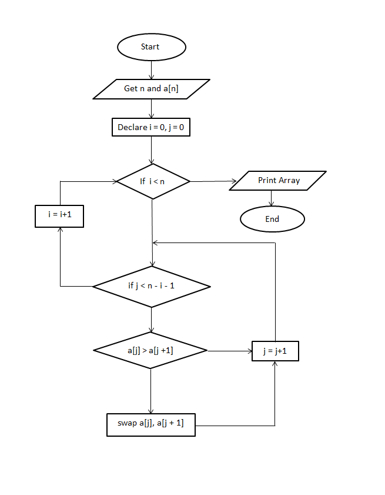

# BubbleSort-Ten-Numbers
- Objective:

    To create a program which is used to Bubble Sort the given 10 numbers in ascending order.

The repository consists of following directories:

- Assets:

    Assets are flowchart files. We created our flowchart for the task using Plantuml and stored it here.

- Docs:

    It contains various issues we faced while developing Source for the given task. It is useful for future purpose while debugging a same kind of issue.

- Src:

    It contains our task's source. We can pull this source and work with it on any required time.

The following is the flowchart for the task using Word Document:

- Version:

    bubbleSort_10_numbers Version_v1.0.0